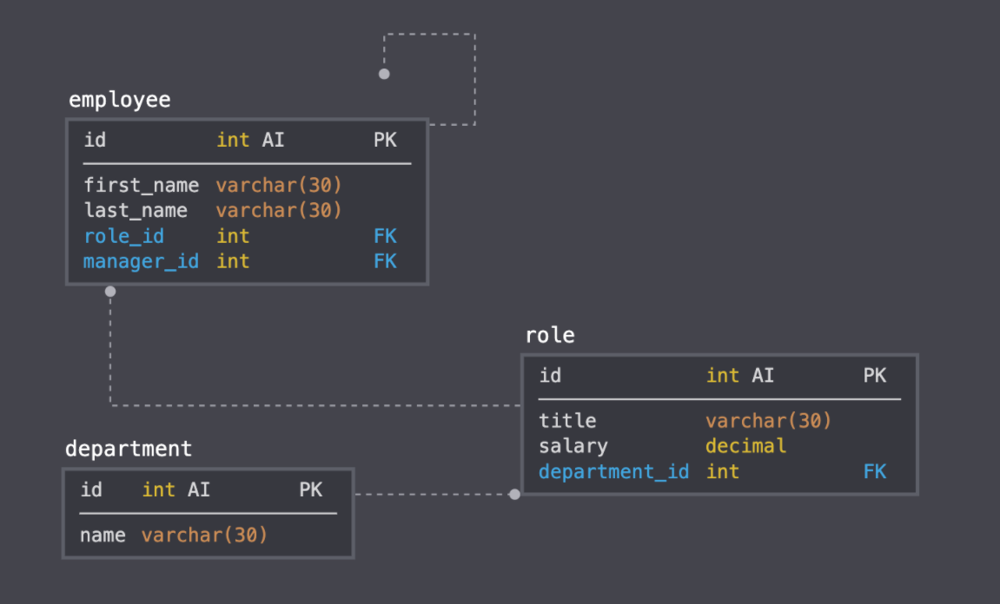

# Employee_Tracker

 ## Description 
The MySQL Employee Tracker assignment was to architect and build a solution for managing a company's employees using node, inquirer, and MySQL.
  
The command-line application that I created allows the user to:

 1) Add departments, roles, employees 
 
 2) View departments, roles, employees
 
 3) Update employee roles
 
 4) Delete Employees
 
## Process
  The first step was to install node and the dependencies were MySQL, Inquirer and Console.table. I worked on connecting the MySQL database and perform the queries with the MySQL NPM package. I also used InquirerJS NPM package to interact with the user via the command-line. The console.table was used to print MySQL rows to the console and I created a seed.sql to pre-populate my database. This project was a bit challenging as the code was extremely long, but once I got an understanding of the code it was rewarding to see how the application played out. Please see below for some snippets:

 Here is a GIF of my Employee Tracker that got generated from Git Bash:

 
  
 Snippet of the department table created on workbench:
 
  
 List of employees generated:
 
  
 List of all the different roles displayed:
 
  
  Snippet of my seeds.sql to help me pre-populate my database:
 
  
 Database Schema containing 3 tables:
 
 

 ## Installation
 You will need VS code and the dependencies are Inquirer, MySQL and Console.table.
 
 ## Usage 
 For users who want to be able to view and manage the departments, roles, and employees in their company so that they can organize and plan out their business.

### Installing/Technology Used

The following platforms were required to build this website:

1) VS code
2) GitBash/Terminal
3) GitLab
4) GitHub
5) Inquirer
6) MySQL (Workbench)

## Built With

* [Node.js](https://nodejs.dev/learn/the-package-json-guide)
* [MySQL Workbench](https://dev.mysql.com/downloads/workbench/)
* [Inquirer](https://www.npmjs.com/package/inquirer)
* [Console.Table](https://www.npmjs.com/package/console.table)

## Deployed Link

* [See Live Site](https://drive.google.com/file/d/1yFLu8LrLVE3oKIShedkO_lbtZA4tTzkA/view)

 ## Authors

* **Kelly Kim** 

- [Link to Github](https://github.com/kellykim831)
- [Link to LinkedIn](https://www.linkedin.com/in/realtorkellykim/)
- [Link to Facebook](https://www.facebook.com/kimkelz)

## Acknowledgments

* [Link to Google](https://www.google.com)
* [Link to W3 Schools](https://www.w3schools.com)
* [Link to StackOverflow](https://www.stackoverflow.com)
* [Link to Node.js](https://nodejs.org/en/)